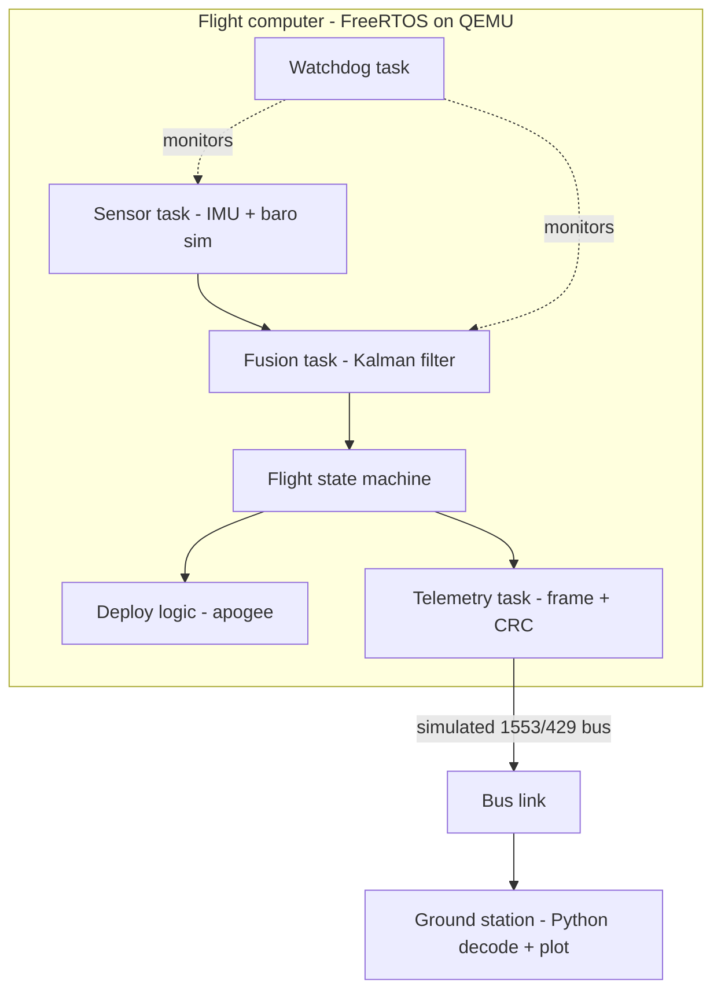

# P6 — AeroPilot: a model-rocket / CubeSat flight computer + mission control

> Biggest new-skill investment, but it opens the entire defense/aerospace/embedded cluster your portfolio doesn't currently touch.

## 1. What it is

AeroPilot is the **flight software** for a hobby model rocket (or a tiny CubeSat), simulated end-to-end so it needs **no physical hardware**. On a simulated launch it:

- runs a **deterministic real-time scheduler** with hard-priority tasks,
- **fuses sensor data** (IMU + barometer) to estimate altitude and attitude,
- detects **apogee** to fire a "deploy parachute" event,
- enters a **safe state** if a task hangs (watchdog),
- streams **telemetry** over a simulated avionics bus to a ground station that replays the whole flight.

"I wrote flight software for a rocket" is a fantastic interview hook, and every piece maps to what defense/aerospace embedded roles screen for: determinism, sensor fusion, fault tolerance, avionics buses (MIL-STD-1553 / ARINC-429), and MISRA/DO-178C-style discipline.

## 2. What you'll demonstrate

- **Real-time embedded engineering** in C on an RTOS.
- **Deterministic scheduling** — fixed-priority preemption, bounded worst-case latency, measured jitter.
- **Sensor fusion** — a complementary or Kalman filter.
- **Fault tolerance** — watchdog + safe-state recovery.
- **Protocol/framing** — CRC-protected telemetry over a simulated 1553/429 bus.
- **Safety-critical discipline** — MISRA-style coding, static analysis, a documented verification suite.

## 3. Tech stack (and why)

- **C (C11)**, some **C++** — the language of embedded/flight software.
- **FreeRTOS** — the most widely used RTOS; gives you tasks, priorities, queues, semaphores. Runs on QEMU.
- **QEMU** (emulating an ARM Cortex-M / `mps2-an385` or STM32 target) — so you need **no hardware**; deterministic and CI-friendly. (Optional: a cheap STM32 "Blue/Black Pill" board later.)
- **CMake + GCC arm-none-eabi** — the standard cross-build toolchain.
- **Unity** (ThrowTheSwitch) — C unit testing; runs host-side.
- **cppcheck** (+ optionally a MISRA add-on) — static analysis.
- **Python + matplotlib** — the ground station that decodes and plots telemetry.

## 4. Architecture



## 5. Data model / formats

- **Sensor sample:** `{ t, ax, ay, az, gx, gy, gz, pressure }` (from a physics sim of the flight).
- **State estimate:** altitude, vertical velocity, attitude (pitch/roll).
- **Flight state machine:** `IDLE -> ARMED -> BOOST -> COAST -> APOGEE -> DESCENT -> LANDED` (+ `SAFE` fault state).
- **Telemetry frame:** fixed-size binary record: `[sync][seq][state][alt][vel][batt][flags][CRC16]`. Framing + CRC is the "bus protocol" work.

## 6. Implementation plan (milestones)

**M1 — Toolchain + blinky on QEMU.** Get FreeRTOS building with CMake/arm-none-eabi and running on QEMU. One task toggling a simulated LED / printing over semihosting. This is the hardest setup step — budget for it.

**M2 — Flight physics sim + sensor task.** Write a simple rocket physics model (thrust curve, drag, gravity) that produces synthetic IMU/baro samples over time. A sensor task feeds these into a queue at a fixed rate.

**M3 — Sensor fusion.** Implement a **complementary filter** first (easy, robust), then a **1-D Kalman filter** for altitude/vertical-velocity from baro + accel. Verify against the known simulated trajectory.

**M4 — Flight state machine + apogee detect + deploy.** Drive the state machine from the fused estimate; detect apogee (vertical velocity crosses zero / altitude peaks) and fire the deploy event with a hard timing guarantee. Log state transitions.

**M5 — Telemetry framing + simulated bus.** Serialize state into fixed-size frames with a **CRC16**; send over a simulated **MIL-STD-1553** *or* **ARINC-429** channel (model the bus as a byte stream/queue with the right word format). Python ground station decodes, checks CRC, and plots altitude/velocity/state.

**M6 — Watchdog + fault handling.** A watchdog task monitors that other tasks "check in" each period; if one hangs, transition to `SAFE` (e.g., stop deploy, hold last-good state), log the fault, and recover. Inject a hang to prove it.

**M7 — Rigor: tests, static analysis, docs.** Unity unit tests for the filter, CRC, state machine, and framing; run cppcheck clean; write DO-178C-flavored docs (requirements -> design -> tests traceability). Measure scheduler jitter.

## 7. The hard parts, explained

- **Determinism:** fixed-priority preemptive scheduling means the highest-priority ready task always runs. You must reason about worst-case timing and avoid priority inversion (use priority inheritance on shared resources). Measure jitter, don't assume it.
- **Kalman filter tuning:** the process/measurement noise covariances (Q, R) determine how much you trust the model vs. the sensor. Tune against your known simulated trajectory; a complementary filter is a fine fallback if Kalman tuning eats too much time.
- **Apogee detection is noisy:** raw baro is jittery; detect apogee from the *filtered* velocity crossing zero with debouncing, or you'll deploy early.
- **CRC + framing:** pick CRC16 (e.g., CCITT), define a sync word, and handle partial/garbled frames on the ground side — this is the "avionics protocol" credibility.
- **Watchdog design:** the watchdog must itself be reliable (highest priority) and the "check-in" mechanism must not deadlock. Safe-state must be genuinely safe (fail to a known good).

## 8. Testing & correctness

- **Host-side Unity tests** for pure logic: Kalman step, CRC, state transitions, framing/deframing.
- **Scenario tests:** feed a full simulated flight; assert the state machine hits states in order and deploys within a window of true apogee.
- **Fault-injection:** force a task to hang; assert the watchdog trips to `SAFE` within the deadline and logs it.
- **Bus tests:** corrupt bytes on the simulated bus; assert the ground station rejects bad-CRC frames.
- **Static analysis in CI:** cppcheck must be clean; track coverage.

## 9. Benchmarking & metrics

- **Scheduler jitter / worst-case task latency** (a measured deterministic bound).
- **Apogee-detection error** vs. true apogee (from the sim).
- **Fault-detection-to-safe-state time.**
- **Unit-test coverage %** and **zero cppcheck warnings**.

## 10. How to run

```bash
cmake -B build -DCMAKE_TOOLCHAIN_FILE=cmake/arm-none-eabi.cmake
cmake --build build
qemu-system-arm -M mps2-an385 -kernel build/aeropilot.elf -serial stdio  # runs the flight
python groundstation/decode.py --port /tmp/telemetry.sock                 # decode + plot
ctest --test-dir build                                                    # Unity tests
cppcheck --enable=all src/
```

## 11. Suggested repo structure

```
aeropilot/
  cmake/                 # arm-none-eabi toolchain file
  src/
    tasks/               # sensor, fusion, state-machine, telemetry, watchdog
    fusion/              # complementary + Kalman filter
    proto/               # frame + CRC16, 1553/429 bus model
    sim/                 # rocket physics -> synthetic sensor samples
  freertos/              # FreeRTOS kernel + config
  test/                  # Unity host tests
  groundstation/         # Python decode + matplotlib plots
  docs/                  # requirements, design, verification traceability (DO-178C-flavored)
  README.md
```

## 12. Stretch goals

- Run on **real STM32 hardware** with a real IMU/baro (huge credibility bump).
- Add **DDS-style pub/sub** telemetry (RTI Connext is used in defense).
- Produce a **formal MISRA C:2012 compliance report**.
- Extend `IDLE->...->LANDED` into a **CubeSat** mode (detumble, sun-pointing) for a space angle.

## Resume bullets (tune with your real numbers)

- Built **AeroPilot**, a **deterministic flight computer** in **C** on **FreeRTOS** (QEMU) with fixed-priority scheduling, a **Kalman-filter sensor-fusion** loop, apogee detection, and watchdog fault recovery, bounding worst-case task latency and reaching safe-state in **under X ms**.
- Implemented a **simulated MIL-STD-1553 / ARINC-429** telemetry bus with CRC framing plus a Python ground station, verified by **140+ Unity tests** at **>90% coverage** with **zero cppcheck warnings**.
