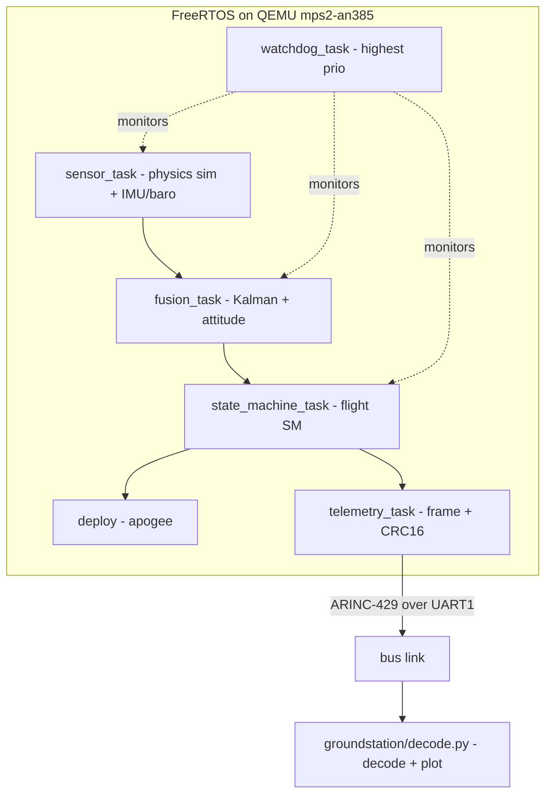

# AeroPilot

A deterministic **model-rocket flight computer** written in C on **FreeRTOS**,
simulated end-to-end on **QEMU** (ARM Cortex-M3 `mps2-an385`) so it needs **no
hardware**, plus a Python **ground station** that decodes and plots the flight.

On a simulated launch AeroPilot:

- runs a **fixed-priority preemptive real-time scheduler** with a watchdog,
- **fuses IMU + barometer** data (Kalman + complementary filters) to estimate
  altitude, vertical velocity and attitude,
- drives a **flight state machine** (`IDLE -> ARMED -> BOOST -> COAST -> APOGEE
  -> DESCENT -> LANDED`, plus a `SAFE` fault state),
- detects **apogee** and fires a **parachute-deploy** event,
- enters a **SAFE** state if a task hangs (watchdog),
- streams **CRC-protected telemetry** over a simulated **ARINC-429** avionics
  bus to a ground station that replays the whole flight.

## Architecture



## Repository layout

```
aeropilot/
  cmake/            arm-none-eabi toolchain file
  src/
    sim/            rocket physics -> synthetic IMU/baro samples
    fusion/         complementary + 1-D Kalman filters
    state/          flight state machine + apogee/deploy
    proto/          CRC16, frame codec, ARINC-429 word + bus model
    watchdog/       stall-detection monitor logic
    tasks/          FreeRTOS tasks (sensor, fusion, SM, telemetry, watchdog)
    app/            main.c wiring + hooks
  freertos/         FreeRTOS-Kernel (submodule) + board port (mps2-an385)
  test/             Unity host tests (submodule: Unity)
  groundstation/    Python decode + matplotlib plot
  docs/             requirements, design, verification, metrics
  .github/          CI workflow
```

The `src/sim`, `src/fusion`, `src/state`, `src/proto` and `src/watchdog`
modules are pure C11 with no RTOS dependency, so the exact same code runs in the
firmware and in the host unit tests.

## Prerequisites

- `gcc-arm-none-eabi` (cross toolchain)
- `qemu-system-arm`
- `cmake` (>= 3.16) and a host C compiler (for tests)
- `cppcheck`
- Python 3 with `matplotlib`

On Debian/Ubuntu:

```bash
sudo apt-get install -y gcc-arm-none-eabi qemu-system-arm cppcheck cmake python3-matplotlib
```

Clone with submodules (FreeRTOS-Kernel and Unity):

```bash
git clone --recurse-submodules <repo-url>
# or, if already cloned:
git submodule update --init --recursive
```

## Build & run the flight (firmware on QEMU)

```bash
cmake -B build -DCMAKE_TOOLCHAIN_FILE=cmake/arm-none-eabi.cmake -DAEROPILOT_BUILD=firmware
cmake --build build

qemu-system-arm -M mps2-an385 -cpu cortex-m3 -kernel build/aeropilot.elf \
  -display none -monitor none -serial stdio -serial file:/tmp/telemetry.bin -semihosting
```

UART0 (stdout) carries the human-readable flight log; UART1 carries the binary
ARINC-429 telemetry, captured here to `/tmp/telemetry.bin`. The firmware exits
QEMU via semihosting when the flight completes.

## Decode + plot telemetry (ground station)

```bash
python3 groundstation/decode.py --file /tmp/telemetry.bin --plot out.png --check
```

It validates word parity + frame CRC, re-synchronises after corruption,
prints the state sequence and observed apogee, and writes a plot of
altitude / vertical velocity / flight state.

## Run the tests

```bash
cmake -B build-host -DAEROPILOT_BUILD=host_tests
cmake --build build-host
ctest --test-dir build-host --output-on-failure
```

## Static analysis

```bash
cppcheck --enable=warning,performance,portability --std=c11 \
  --error-exitcode=2 --suppress=missingInclude --inline-suppr -I src src
```

## Watchdog fault injection

Build a firmware that deliberately hangs the fusion task shortly after launch
to prove the watchdog trips to `SAFE`:

```bash
cmake -B build-hang -DCMAKE_TOOLCHAIN_FILE=cmake/arm-none-eabi.cmake \
  -DAEROPILOT_BUILD=firmware -DAEROPILOT_INJECT_HANG=1.5
cmake --build build-hang
qemu-system-arm -M mps2-an385 -cpu cortex-m3 -kernel build-hang/aeropilot.elf \
  -display none -monitor none -serial stdio -serial file:/tmp/tele_hang.bin -semihosting
# log prints "SAFE STATE ENTERED"; decode /tmp/tele_hang.bin to see the SAFE flag
```

## Results (reference run)

- Apogee ~106.6 m; ground-station apogee error **+0.0 m** vs truth.
- Sensor task period jitter: **0 ticks** over ~1500 samples (deterministic).
- Fault-detection-to-SAFE: bounded to **<= ~300 ms** (3 x watchdog period).
- Host tests: **11 suites**, all passing; cppcheck clean.

See `docs/` for requirements, design, verification traceability and metrics.

## Continuous integration

`.github/workflows/ci.yml` installs the toolchain, runs cppcheck, builds and
runs the host tests, builds the firmware, runs the flight on QEMU and decodes
the telemetry, and runs the watchdog fault-injection flight.

## Stretch goals

- Run on real STM32 hardware with a real IMU/baro.
- DDS-style pub/sub telemetry.
- Formal MISRA C:2012 compliance report.
- Extend to a CubeSat mode (detumble, sun-pointing).
