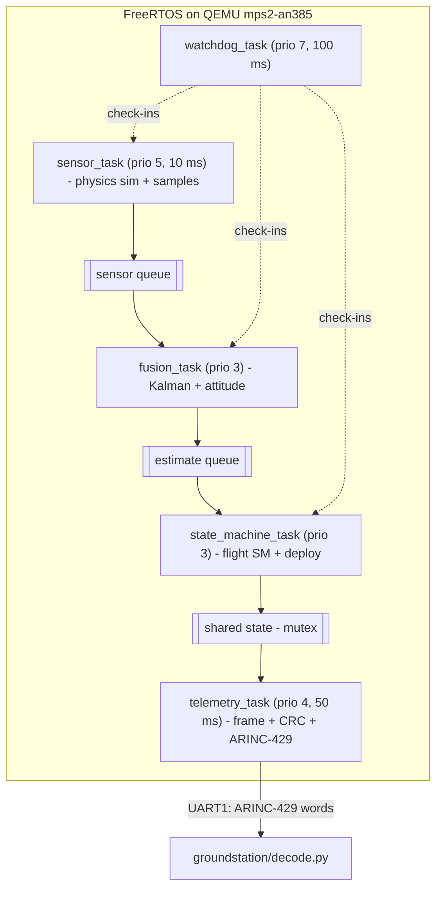

# AeroPilot Software Design (SDD)

## Overview

AeroPilot is flight software for a simulated model rocket. It runs on FreeRTOS
on an emulated ARM Cortex-M3 (`mps2-an385`) under QEMU, with a Python ground
station. The portable logic (sim, fusion, protocol, state machine, watchdog) is
free of RTOS dependencies so it compiles into both the firmware and host tests.

## Task architecture



## Modules and requirement mapping

| Module | Files | Requirements |
|--------|-------|--------------|
| Data model | `src/aeropilot.[ch]` | HLR-2, HLR-3 |
| Physics sim | `src/sim/rocket_sim.[ch]` | SRS-SIM-1..3 |
| Kalman filter | `src/fusion/kalman.[ch]` | SRS-FUSE-1, SRS-FUSE-4 |
| Complementary filters | `src/fusion/complementary.[ch]` | SRS-FUSE-2, SRS-FUSE-3 |
| Fusion front end | `src/fusion/fusion.[ch]` | SRS-FUSE-1..4 |
| Flight state machine | `src/state/flight_sm.[ch]` | SRS-SM-1..6 |
| Watchdog monitor | `src/watchdog/watchdog.[ch]` | SRS-FAULT-1 |
| CRC-16 | `src/proto/crc16.[ch]` | SRS-PROTO-1 |
| Frame codec | `src/proto/frame.[ch]` | SRS-PROTO-1, SRS-PROTO-3 |
| ARINC-429 codec | `src/proto/arinc429.[ch]` | SRS-PROTO-2, SRS-PROTO-3 |
| Bus transport | `src/proto/bus.[ch]` | SRS-PROTO-2 |
| Tasks / wiring | `src/tasks/*.c`, `src/app/main.c` | SRS-SCHED-1..4, SRS-FAULT-2..4 |
| Board port | `freertos/port/*` | HLR-1 |
| Ground station | `groundstation/decode.py` | HLR-7, SRS-PROTO-3, SRS-PROTO-4 |

## Key design decisions

- **Determinism**: fixed-priority preemptive scheduling; the watchdog is the
  highest-priority task; periodic tasks use `vTaskDelayUntil` for absolute
  cadence. Telemetry out-prioritises fusion/state so SAFE is always reported.
- **Fusion**: a 1-D constant-acceleration Kalman filter (state `[alt, vel]`,
  accelerometer as control input, barometer as measurement). A complementary
  filter is provided as the robust fallback the spec endorses.
- **Apogee detection**: taken from the *filtered* velocity crossing zero, with
  a debounce counter and minimum-altitude guard to reject barometric noise.
- **Bus protocol**: an 18-byte CRC-16/CCITT frame is packed into ARINC-429
  words (odd parity, telemetry label). This gives two independent error-
  detection layers (per-word parity and per-frame CRC).
- **Watchdog**: each monitored task publishes a monotonic check-in counter; a
  task that fails to advance for `WATCHDOG_MAX_MISSED` periods (~300 ms) trips
  the vehicle to SAFE, which latches.

## Frame format

```
off size field           off size field
0   2    sync = 0xA55A   10  4    velocity (f32)
2   2    seq (u16)       14  2    batt (u16 mV)
4   1    state           16  2    crc16 (over bytes 0..15)
5   1    flags           
6   4    altitude (f32)  
```
